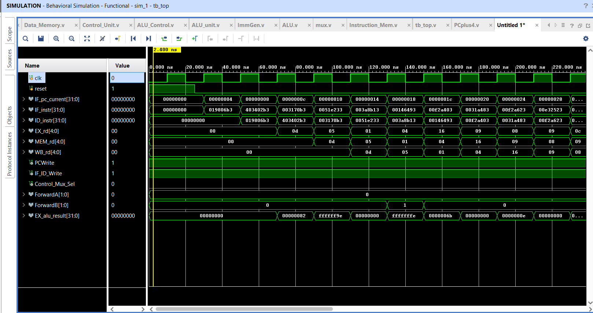
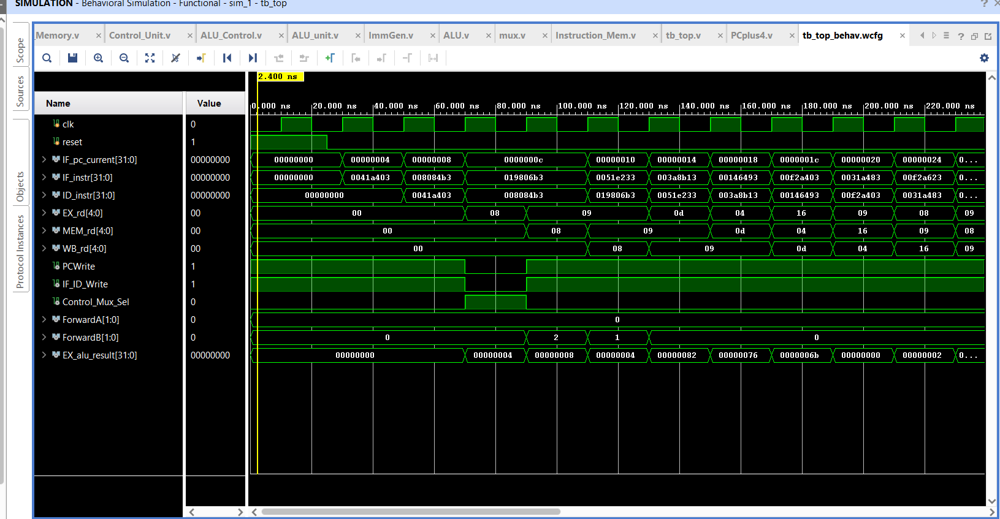

# 5-Stage Pipelined RISC-V Processor (RV32I)
 
A fully functional RISC-V RV32I 5-stage pipelined processor implemented in Verilog and simulated using Xilinx Vivado. Built from scratch as an advanced progression from a single-cycle baseline to handle hardware-level pipeline parallelism, data hazards, and branch control.
 
---
 
## Architecture Overview
 
The processor implements the classic 5-stage pipelined datapath — Fetch, Decode, Execute, Memory, Writeback. Unlike a single-cycle design, multiple instructions execute concurrently across different stages every clock cycle. To maintain correctness without sacrificing performance, two dedicated hardware units are integrated directly into the datapath:
 
- **Forwarding Unit** — detects Read-After-Write (RAW) data hazards and routes data straight from the EX/MEM or MEM/WB pipeline registers directly to the ALU inputs, eliminating stalls for consecutive arithmetic sequences.
- **Hazard Detection Unit** — identifies load-use data hazards and freezes the pipeline by dropping `PCWrite` and `IF_ID_Write` while injecting an execution bubble (NOP) to preserve state stability during memory latency.
```
                 [ Hazard Detection Unit ]
                           ↓ stall control
PC → [IF/ID] → Reg File → [ID/EX] → ALU → [EX/MEM] → Data Mem → [MEM/WB] → Writeback
                   ↑                                        ↓
              Control Unit                          Forwarding Unit
```
 
---
 
## Supported Instructions
 
| Type | Instructions |
|---|---|
| R-type | ADD, SUB, AND, OR |
| I-type | ADDI, ORI |
| Load | LW |
| Store | SW |
| Branch | BEQ |
 
---
 
## Module Breakdown
 
| Module | File | Description |
|---|---|---|
| Program Counter | `PC.v` | 32-bit register tracking the current instruction address; supports hardware stalls via PCWrite |
| PC Adder | `PCplus4.v` | Computes PC+4 combinationally for sequential fetching |
| Instruction Memory | `Instruction_Mem.v` | 64-word ROM, combinational read, initialized via `initial` block |
| IF/ID Register | `IF_ID_Reg.v` | Captures PC+4 and instruction between fetch and decode stages |
| ID/EX Register | `ID_EX_Reg.v` | Carries register data, immediate, control signals, and register addresses into execute stage |
| EX/MEM Register | `EX_MEM_Reg.v` | Passes ALU result, Rd2, zero flag, and control signals into memory stage |
| MEM/WB Register | `MEM_WB_Reg.v` | Passes ALU result and memory read data into writeback stage |
| Register File | `Reg_File.v` | 32×32-bit registers, 2 combinational read ports, 1 synchronous write port |
| Immediate Generator | `ImmGen.v` | Sign-extends scattered bit fields for I, S, and B instruction types |
| Control Unit | `Control_Unit.v` | Decodes opcode and generates all datapath control signals |
| ALU Control | `ALU_Control.v` | Fine-decodes ALU operation from ALUOp + funct3 + funct7 |
| ALU | `ALU_unit.v` | Supports ADD, SUB, AND, OR with Zero flag output |
| Data Memory | `Data_Memory.v` | 64-word RAM, synchronous write, combinational read |
| Muxes | `mux.v` | ALUSrc, MemtoReg, and 3-way forwarding muxes |
| Forwarding Unit | `Forwarding_Unit.v` | Bypasses data hazards by routing current stage results back to EX inputs |
| Hazard Detection Unit | `Hazard_Detection_Unit.v` | Detects load-use dependencies and manages stalls and bubble injection |
| Top Level | `top.v` | Instantiates and wires all modules together |
| Testbench | `tb_top.v` | Generates clock and active-high reset stimulus |
 
---
 
## Simulation Setup
 
**Tool:** Xilinx Vivado 2022.2 (XSim behavioral simulator)
 
**Clock period:** 20ns (50 MHz, toggles every 10ns)
 
**Reset:** Active-high, held for 25ns then released — timed cleanly between clock edges to allow full pipeline clearing before execution begins
 
**Instruction memory:** Pre-loaded with a hazard-triggering sequence via Verilog `initial` block to validate both forwarding and stall behaviour
 
---
 
## Verified Test Program
 
```
NOP                     // I_Mem[0]  — pipeline warmup
lw   x8,  4(x3)        // I_Mem[1]  — load from memory into x8 (triggers load-use hazard)
add  x9,  x1,  x8      // I_Mem[2]  — uses x8 immediately (stall injected by hazard unit)
add  x13, x16, x25     // I_Mem[3]  — 40 + 90 = 130 (0x82), forwarded result
sub  x5,  x8,  x3      // I_Mem[4]  — 2 - 24 = -22 (0xFFFFFFEA)
```
 
To verify hazard handling — watch `PCWrite` and `IF_ID_Write` drop to 0 during the load-use stall window. Both signals return to 1 once the hazard is resolved.
 
---

## Hardware Verification & Waveforms

The design has been validated through behavioral simulation via testbenches targeting explicit arithmetic dependency chains and load-use hazard boundaries.

### 1. Steady-State Pipeline Execution

During consecutive R-type and I-type operation blocks, instructions stream diagonally across the tracking lanes. The Forwarding Unit dynamically switches routing states to maintain a single-cycle execution path without requiring pipeline bubbles.



### 2. Load-Use Hazard Stall Injection

When a dependency immediately follows a memory load instruction (`lw`), the Hazard Detection Unit safely intercepts execution. It holds the Program Counter, freezes the decode registers, and injects a single-cycle NOP bubble into the execution stage until data memory access completes.


 
## Key Design Decisions
 
**Pipeline registers isolate stages** — each of the four pipeline registers (IF/ID, ID/EX, EX/MEM, MEM/WB) captures outputs on the rising clock edge and holds them stable for the next stage, allowing five different instructions to occupy five different stages simultaneously without signal interference.
 
**Bubble injection for load-use hazards** — when the hazard detection unit identifies a load followed immediately by a dependent instruction, it strips the ID/EX control word to zeros and forces `EX_rd = 0`, effectively injecting a single-cycle NOP bubble. This gives data memory one extra cycle to complete before the waiting instruction enters the execute stage.
 
**Three-way forwarding muxes at EX inputs** — instead of always reading from the register file, the ALU inputs are driven by 3-way muxes controlled by the forwarding unit. If EX/MEM or MEM/WB holds a result matching the current instruction's source register, the forwarding unit selects that result directly — bypassing the register file entirely and eliminating unnecessary stalls.
 
**Control signals travel with instructions** — in a single-cycle design, control signals are generated fresh every cycle. In the pipeline, each instruction's control signals are captured in the ID/EX register and propagate stage by stage alongside the data, ensuring that the right control signals reach the right stage at the right time.
 
---
 
## How to Simulate
 
1. Open Xilinx Vivado and create a new RTL project
2. Add all `.v` files as design sources
3. Add `tb_top.v` as a simulation source and set it as simulation top
4. Run Behavioral Simulation
5. Add these signals to the waveform: `clk`, `reset`, `PC_top`, `instruction_top`, `PCWrite`, `IF_ID_Write`, `ForwardA`, `ForwardB`, `EX_alu_result`, `WriteBack_top`
6. Run for 500ns
7. Observe `PCWrite` and `IF_ID_Write` drop to 0 during the load-use stall window to confirm hazard detection is working
---
 
## What I Learned
 
- How to partition a continuous single-cycle datapath into synchronous pipeline stages without losing signal integrity across clock boundaries
- How to design forwarding logic that detects register address matches across pipeline stages and dynamically routes results back to execution inputs
- How load-use hazards require a mandatory stall cycle even with forwarding, and how to inject a clean bubble without corrupting surrounding pipeline state
- How to read and interpret staggered waveforms across multiple pipeline stages to verify correct instruction sequencing and data flow
- How control signals must travel through pipeline registers alongside data rather than being regenerated each cycle
---
 
## References
 
- Patterson & Hennessy — *Computer Organization and Design: RISC-V Edition* (2nd Ed.)
- [RISC-V ISA Specification](https://riscv.org/technical/specifications/)
- [Single-Cycle baseline implementation](https://github.com/rrohanbanik-spec/Single-Cycle-RISCV-Processor)
---
 
## Author
 
**Rohan Pal Banik** — 2nd year VLSI engineering student  
Built during summer 2026 as part of a self-directed RTL learning plan. Progression from single-cycle to pipelined design.